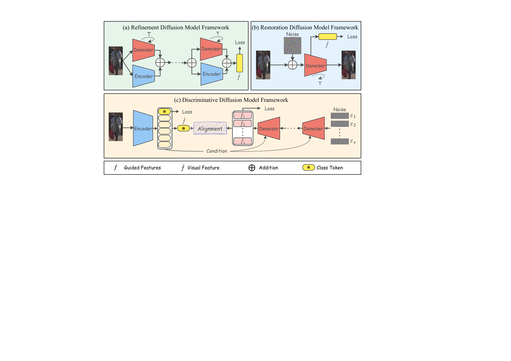
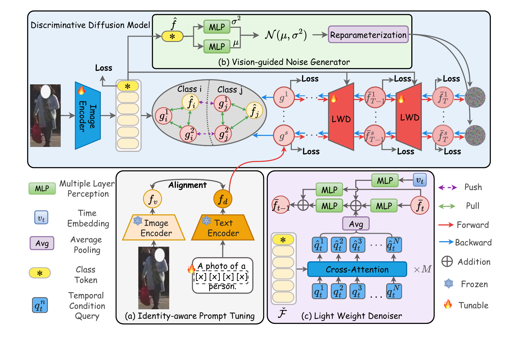
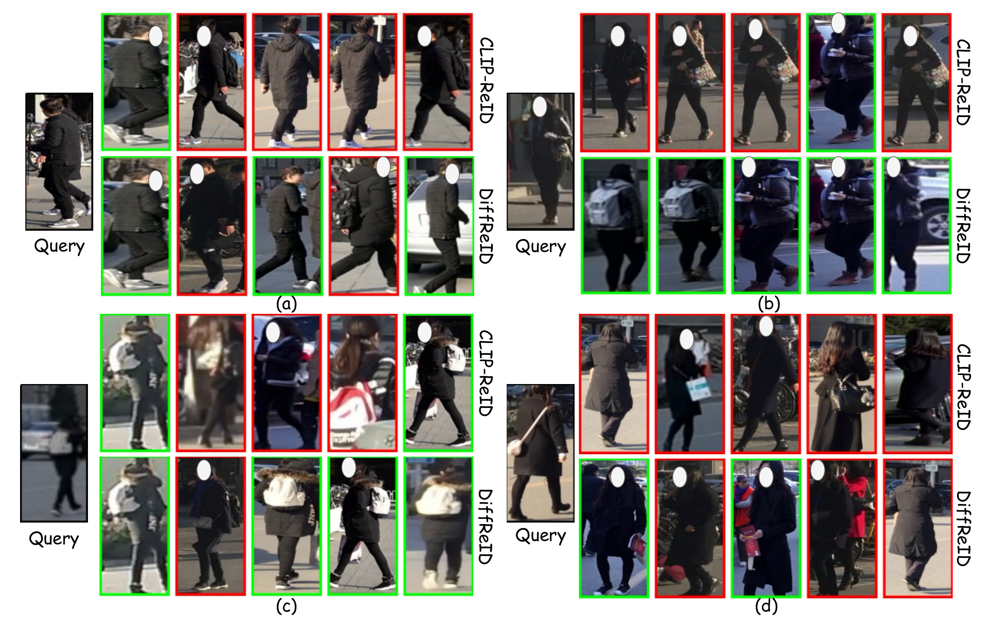
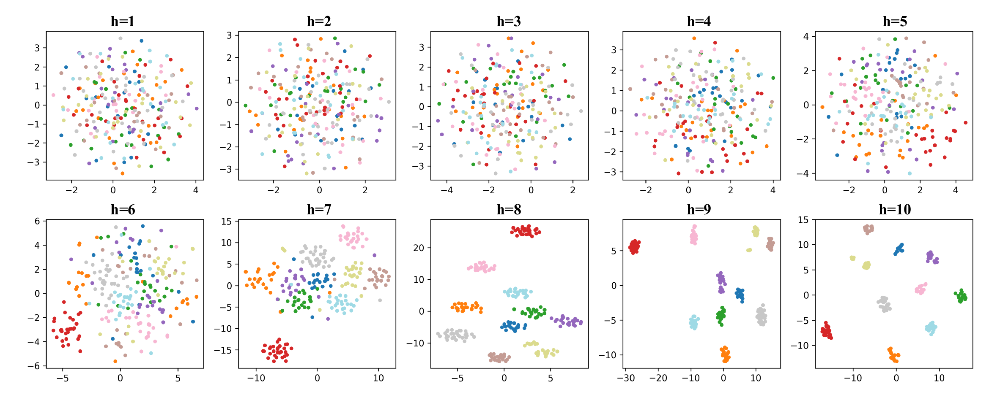
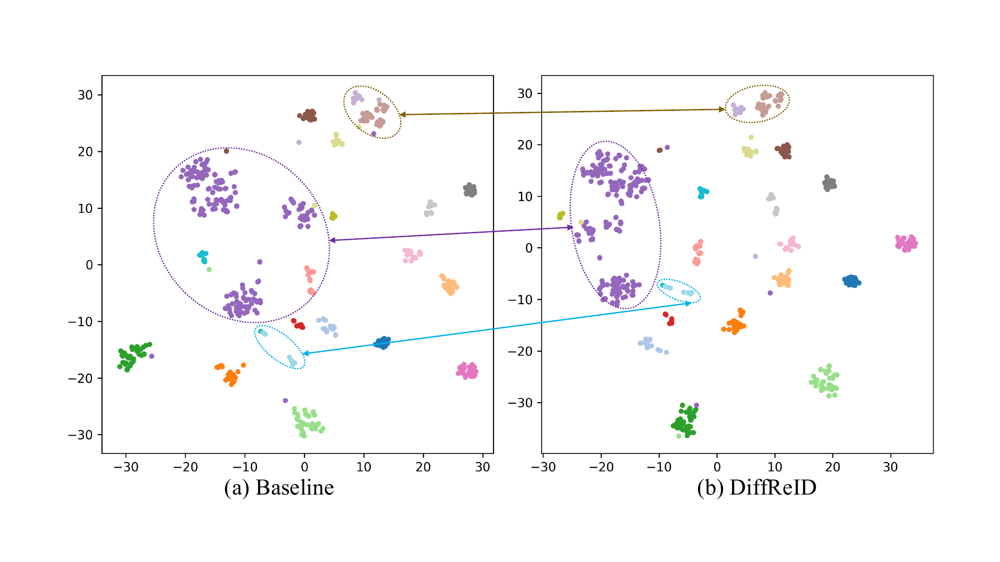

<div align="center">

# DiffReID: Discriminative Diffusion Model for Object Re-Identification

Yingquan Wang, Pingping Zhang<sup>*</sup>, Dong Wang, Huchuan Lu

Dalian University of Technology

*IEEE Transactions on Image Processing (TIP)*

</div>

## Introduction

Most existing object ReID methods have trouble generalizing because ReID datasets are small and lack diversity. They also tend to learn semantic patterns instead of identity-aware feature distributions. **DiffReID** is a feature learning framework that uses a **discriminative diffusion model** to learn identity-aware distributions step by step and to generate identity-invariant features.

<p align="center">
  
</p>

## Framework



- **Identity-aware Prompt Tuning**: uses CLIP and prompt tuning to get identity-aware text features.
- **Vision-guided Noise Generator (VNG)**: initializes probabilistic noise from visual features and gradually corrupts the identity-aware text features.
- **Light Weight Denoiser (LWD)**: uses visual features as conditions and denoises the corrupted text features step by step to learn identity-aware distributions. Identity-invariant guided features are then generated from randomly sampled visual-guided noise.
- **Mutual Enhancement Constraint (MEC)**: makes visual features and guided features learn from each other, which makes the representation more robust and discriminative.

## Main Results

### Single-domain Comparison

| Method | Market1501 mAP | Market1501 R-1 | MSMT17 mAP | MSMT17 R-1 | DukeMTMC mAP | DukeMTMC R-1 | VeRi-776 mAP | VeRi-776 R-1 |
| :-- | :-: | :-: | :-: | :-: | :-: | :-: | :-: | :-: |
| CLIP-ReID | 90.5 | 95.4 | 75.8 | 89.7 | 83.1 | 90.8 | 84.5 | 97.3 |
| DenoiseRep | 91.1 | 95.8 | 76.3 | 90.6 | 83.7 | 91.6 | – | – |
| CLIMB-ReID | 92.6 | 96.8 | 77.8 | 90.5 | – | – | – | – |
| **DiffReID (Ours)** | **91.5** | **96.1** | **79.0** | **91.2** | **85.6** | **92.4** | **84.7** | **97.4** |

### Domain Generalization

| Training | Method | Market1501 mAP / R-1 | MSMT17 mAP / R-1 | CUHK03-NP mAP / R-1 | DukeMTMC mAP / R-1 |
| :-- | :-- | :-: | :-: | :-: | :-: |
| Market1501 | CLIP-ReID | – | 23.0 / 48.9 | 38.5 / 39.9 | 51.7 / 69.6 |
| Market1501 | **DiffReID (Ours)** | – | **24.6 / 51.5** | **41.2 / 43.5** | **51.9 / 71.8** |
| MSMT17 | CLIP-ReID | 51.5 / 76.2 | – | 38.9 / 40.2 | 58.0 / 74.9 |
| MSMT17 | **DiffReID (Ours)** | **54.2 / 82.5** | – | **40.7 / 42.7** | **60.3 / 76.0** |
| Multi-source | OGNorm | 65.2 / 87.1 | 25.9 / 57.7 | 40.3 / 44.0 | – |
| Multi-source | **DiffReID (Ours)** | 61.6 / 82.3 | **26.8** / 52.6 | **50.7 / 51.4** | **61.5 / 76.8** |

*Multi-source: trained on the other three datasets and tested on the unseen one.*

## Visualization

**Retrieval results on MSMT17.** Black boxes are queries, green boxes are correct matches and red boxes are incorrect matches.

<p align="center"></p>

**t-SNE of guided features at successive denoising timesteps.**

<p align="center"></p>

**Feature distributions visualized by t-SNE.** Different colors represent different identities.

<p align="center"></p>

## Code

The code is being cleaned up and will be released soon.

## Acknowledgement

This work builds on [CLIP-ReID](https://github.com/Syliz517/CLIP-ReID), [TransReID](https://github.com/damo-cv/TransReID) and [CLIP](https://github.com/openai/CLIP). Thanks for their great work.

## Citation

If you find this work useful, please cite:

```bibtex
@article{wang2026diffreid,
  title={DiffReID: Discriminative Diffusion Model for Object Re-Identification},
  author={Wang, Yingquan and Zhang, Pingping and Wang, Dong and Lu, Huchuan},
  journal={IEEE Transactions on Image Processing},
  year={2026}
}
```

## Contact

If you have any questions, please contact yingquan_w95@mail.dlut.edu.cn.
